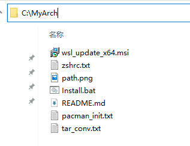

# wsl-archlinux-install 一键安装！
自用的wsl一键安装Archlinux脚本

## 使用方法，一键安装
 0、前置条件:确保你已经开启了WSL功能和虚拟机平台功能，如有其他版本的WSL系统建议卸载。Windows版本为1903 或更高版本，采用内部版本 18362 或更高版本。[参考链接](https://docs.microsoft.com/zh-cn/windows/wsl/install-manual)     
 
建议使用管理员手动执行以下命令名并重启：    

**启用适用于 Linux 的 Windows 子系统 [管理员]**
>dism.exe /online /enable-feature /featurename:Microsoft-Windows-Subsystem-Linux /all /norestart  

**启用“虚拟机平台”可选功能  [管理员]**
>dism.exe /online /enable-feature /featurename:VirtualMachinePlatform /all /norestart  

**如果你在Hyper-v虚拟机中使用WSL则需要为虚拟机开启虚拟化嵌套：  [管理员]**
>Set-VMProcessor -VMName win10vm -ExposeVirtualizationExtensions $true   

***
在你要安装Archlinux的目录新建文件夹，比如C:\MyArch：  
**如果你一切准备好的话，文件看起来应该是这样：**  
    
然后？直接双击运行Install.bat即可安装！ （无需右键管理员！），过程需要联网，因为是联网安装的，所以任何时候用这个脚本安装都是最新版本的Archlinux。    

## 自定义文件说明
修改镜像源: 请编辑替换tar_conv.txt  
修改预安装的包：请编辑pacman_init.txt  
zsh配置：请替换zshrc.tar.gz  

## 如何进入wsl
在命令行敲`WSL`回车就进去了

## 如何卸载
`wsl --unregister ArchLinux`
